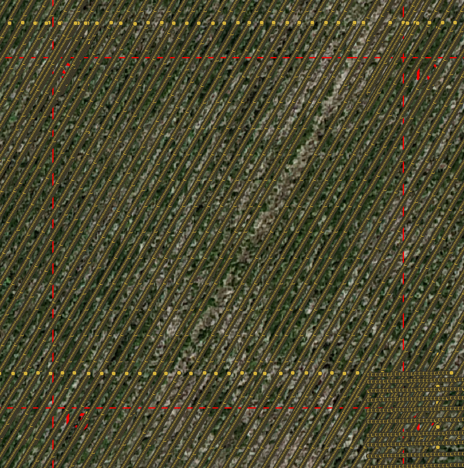

Tutorial with test data
===============================

In this tutorial, we will guide you through the steps to run *crop-row-connector* using the provided test data.

The dataset includes two main files:
- A csv file containing the GPS coordinates of the crop rows.
- A csv file containing the GPS coordinates of all points in the orthomosaic.


A visual representation of all the points in the orthomosaic can be seen below:


    
    detected crop rows in an orthomosaic

To run the *crop-row-connector* with the test data, follow these steps:

1. **Clone the Repository**: If you haven't already, clone the *crop-row-connector* repository from GitHub to your local machine.
    ```bash
    git clone 